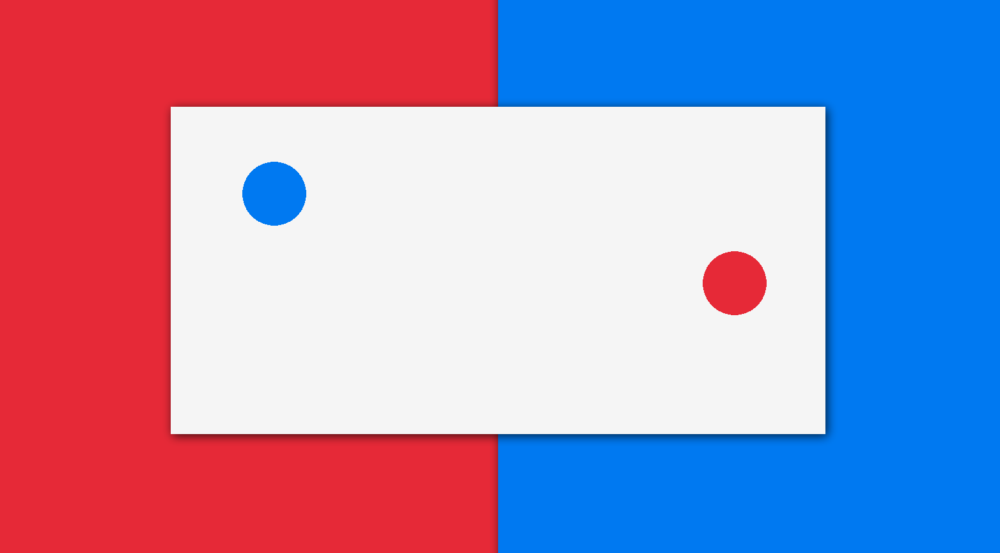

# Game in C with Sockets and Raylib



## Quick Start

Dependencies:
-   [raylib](https://www.raylib.com/)

```console
$ ./build.sh
$ ./main
$ ./player1
$ ./player2
```

### Player Movement
W, S, A, D
